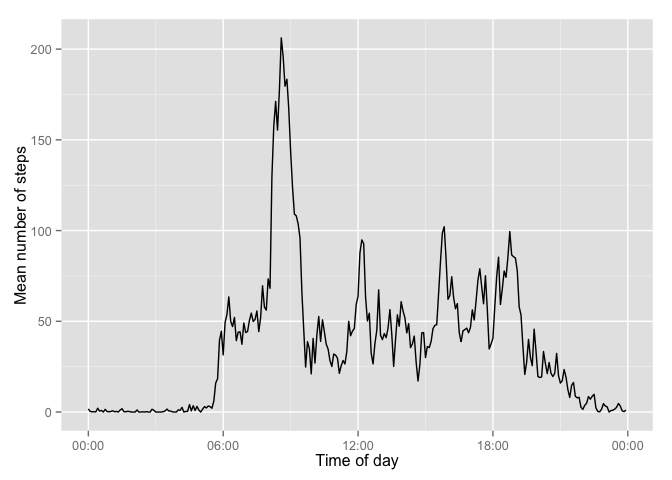
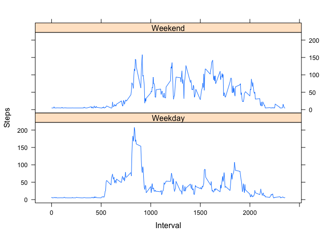

# Reproducible Research: Peer Assessment 1


### Loading and preprocessing the data
Read activity.csv file and stop if there is no data

```r
data <- read.csv ("activity.csv")
if (is.null (data)) {
   stop ("Data Not available....Exiting")
}
```
## What is mean total number of steps taken per day?
1. Calculate the total steps for each day

```r
TotStepsPerDay <- tapply (data$steps, data$date, sum, na.rm=TRUE)
```
2. Make a histogram of the total number of steps taken each day

```r
hist (TotStepsPerDay, xlab="Total Steps", ylab="No. of Days", main="Tota no. of steps taken each day")
```

 


3. Calculate and report the mean and median total number of steps taken per day

```r
MeanTotSteps <- mean(TotStepsPerDay)
MedianTotSteps <- median(TotStepsPerDay)
cat ("Mean total Number of Steps taken per day : ", MeanTotSteps)
```

```
## Mean total Number of Steps taken per day :  9354
```

```r
cat ("Median Total number of steps taken per day : " , MedianTotSteps)
```

```
## Median Total number of steps taken per day :  10395
```
## What is the average daily activity pattern?

1. Make a time series plot (i.e. type = "l") of the 5-minute interval (x-axis)
   and the average number of steps taken, averaged across all days (y-axis)

Find mean no. of steps over all days by time interval
Convert the interval to time and add a column time to data

```r
time <- formatC (data$interval/100, 2, format='f')
DateTime <- as.POSIXct (paste(data$date, time),
                              format='%Y-%m-%d %H.%M', tz='GMT')
data$time <- format(DateTime, format='%H:%M:%S')
data$time <- as.POSIXct (data$time, format='%H:%M:%S')
```
Calculate mean # of steps for each five min interval:

```r
MeanSteps <- tapply (data$steps, data$time, mean, na.rm=TRUE)
DailyPattern <- data.frame(time=as.POSIXct(names(MeanSteps)), MeanSteps=MeanSteps)
```
Plot the graph

```r
library (ggplot2)
library (scales)
ggplot(DailyPattern, aes(time, MeanSteps)) + 
    geom_line() +
    xlab('Time of day') +
    ylab('Mean number of steps') +
    scale_x_datetime(labels=date_format(format='%H:%M'))
```

 


2. Which 5-minute interval, on average across all the days in the dataset, contains the maximum number of steps?

```r
MaxSteps <- which.max(DailyPattern$MeanSteps)
MaxInterval <- format(DailyPattern[MaxSteps,'time'], format='%H:%M')
cat ("The 5-min interval containing maximum number of steps: ", MaxInterval)
```

```
## The 5-min interval containing maximum number of steps:  08:35
```
## Inputing missing values

1. Calculate and report the total number of missing values in the dataset 
   (i.e. the total number of rows with NAs)


```r
TotalNAsinData <- sum(is.na(data$steps))
cat ("The total number of missing values in the dataset: ", TotalNAsinData)
```

```
## The total number of missing values in the dataset:  2304
```

2. Devise a strategy for filling in all of the missing values in the dataset. 
   The strategy does not need to be sophisticated. For example, you could use the 
   mean/median for that day, or the mean for that 5-minute interval, etc.
3. Create a new dataset that is equal to the original dataset but with the 
   missing data filled in.
   I'm using mean to fill in the NA values in the new dataset


```r
MeanNumSteps <- mean(MeanSteps)
NewData <- data
NAIndex <- which(is.na(NewData$steps))
for (i in NAIndex) {
   NewData$steps[i] = MeanNumSteps
}
```

4. Make a histogram of the total number of steps taken each day and Calculate
    and report the mean and median total number of steps taken per day. Do these
    values differ from the estimates from the first part of the assignment? 
    What is the impact of imputing missing data on the estimates of the total
    daily number of steps?

```r
ND_TotStepsPerDay <- tapply (NewData$steps, NewData$date, sum)
hist (ND_TotStepsPerDay, xlab="Total Steps", ylab="No. of Days", main="Tota no. of steps taken each day")
```

 

```r
ND_MeanTotSteps <- mean(ND_TotStepsPerDay)
ND_MedianTotSteps <- median(ND_TotStepsPerDay)
```

## Are there differences in activity patterns between weekdays and weekends?

 For this part the weekdays() function may be of some help here. 
 Use the dataset with the filled-in missing values for this part.

 Create a new factor variable in the dataset with two levels – “weekday” and
 “weekend” indicating whether a given date is a weekday or weekend day.

```r
NewData$date <- as.Date(NewData$date, "%Y-%m-%d")
Days <- weekdays (NewData$date)
NewData$DayType <- ifelse (Days == "Saturday" | Days == "Sunday", "Weekend", "Weekday")
```
 Make a panel plot containing a time series plot (i.e. type = "l") of the 
 5-minute interval (x-axis) and the average number of steps taken, averaged 
 across all weekday days or weekend days (y-axis). See the README file in the 
 GitHub repository to see an example of what this plot should look like using
 simulated data.

```r
AvgStepsByDayType <- aggregate (NewData$steps, by=list(NewData$interval, NewData$DayType), mean)
names(AvgStepsByDayType) <- c("Interval", "Day", "Steps")
library(lattice)
xyplot (Steps~Interval | Day, AvgStepsByDayType, type="l", layout=c(1,2))
```

 

